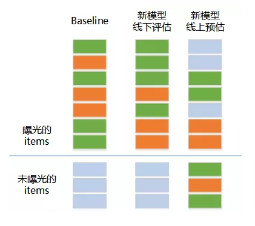

# 百面百搭

> 作者：杨夕、大雨、刘乙己🇻、Stefan、拒绝焦虑李某人、王翔
> 
> 面筋地址：https://github.com/km1994/NLP-Interview-Notes
> 
> 个人笔记：https://github.com/km1994/nlp_paper_study
> 
>  NLP && 推荐学习群【人数满了，加微信 blqkm601 】


- [百面百搭](#百面百搭)
  - [如何挖掘情感极性词典？](#如何挖掘情感极性词典)
  - [问题：推荐系统如何解决重复推荐用户刚刚行为过的item的问题？](#问题推荐系统如何解决重复推荐用户刚刚行为过的item的问题)
  - [问题：WIDEand deep 哪类输入wide，哪类输入deep](#问题wideand-deep-哪类输入wide哪类输入deep)
  - [问题：视频推荐遇到之前推过的视频咋处理?（视频推荐）](#问题视频推荐遇到之前推过的视频咋处理视频推荐)
  - [问题：其他坑总结 【注：参考：时晴 炼丹笔记：推荐系统里的那些坑儿】](#问题其他坑总结-注参考时晴-炼丹笔记推荐系统里的那些坑儿)
  - [问题：工程里的一些坑？ 【注：参考：时晴 炼丹笔记：推荐系统里的那些坑儿】](#问题工程里的一些坑-注参考时晴-炼丹笔记推荐系统里的那些坑儿)
    - [模型工程](#模型工程)
    - [系统工程](#系统工程)
  - [问题：推荐系统健康度问题？ 【注：参考：时晴 炼丹笔记：推荐系统里的那些坑儿】](#问题推荐系统健康度问题-注参考时晴-炼丹笔记推荐系统里的那些坑儿)
  - [问题：评估指标里问题？ 【注：参考：时晴 炼丹笔记：推荐系统里的那些坑儿】](#问题评估指标里问题-注参考时晴-炼丹笔记推荐系统里的那些坑儿)
  - [问题：线上线下不一致问题？ 【注：参考：时晴 炼丹笔记：推荐系统里的那些坑儿】](#问题线上线下不一致问题-注参考时晴-炼丹笔记推荐系统里的那些坑儿)
    - [1. 特征不一致](#1-特征不一致)
    - [2. 数据分布不一致](#2-数据分布不一致)
  - [问题：tensorflow2.0 model.predict内存不断增长，怎么优化（tensorflow优化）](#问题tensorflow20-modelpredict内存不断增长怎么优化tensorflow优化)
  - [问题：Transformer的位置编码公式(自然语言处理)](#问题transformer的位置编码公式自然语言处理)
  - [问题：MSE为什么不能作为分类任务的损失函数，sigmoid与softmax分类有什么优缺点？(自然语言处理)](#问题mse为什么不能作为分类任务的损失函数sigmoid与softmax分类有什么优缺点自然语言处理)
  - [问题：NER任务BIO标签分布不均衡，该怎么进行优化](#问题ner任务bio标签分布不均衡该怎么进行优化)
  - [问题：怎么决定哪些query走字典匹配，哪些走深度模型？](#问题怎么决定哪些query走字典匹配哪些走深度模型)
  - [问题：检索可以用语义检索，精排也是语义吗，模型层面，检索和精排有什么异同](#问题检索可以用语义检索精排也是语义吗模型层面检索和精排有什么异同)
  - [问题：做NER的时候，BERT之上还需要 BiLSTM 吗？ (自然语言处理)](#问题做ner的时候bert之上还需要-bilstm-吗-自然语言处理)
  - [问题：问一下ner标注错误的话有没有啥好的办法检测，修正 (自然语言处理)](#问题问一下ner标注错误的话有没有啥好的办法检测修正-自然语言处理)
  - [问题十：LSTM为什么能解决梯度消失和梯度爆炸(自然语言处理)](#问题十lstm为什么能解决梯度消失和梯度爆炸自然语言处理)
  - [问题九：xgb怎么处理缺省值](#问题九xgb怎么处理缺省值)
  - [问题八：怎么处理未登录词问题](#问题八怎么处理未登录词问题)
  - [问题七：对于生僻词，skip-gram和cbow哪个效果更好？原因是什么？(自然语言处理)](#问题七对于生僻词skip-gram和cbow哪个效果更好原因是什么自然语言处理)
  - [问题六：超过1000个字符长度的文本分类问题如何解决？(自然语言处理)](#问题六超过1000个字符长度的文本分类问题如何解决自然语言处理)
  - [问题五：dropout 和L1 和l2是什么关系，有什么异同? (深度学习)](#问题五dropout-和l1-和l2是什么关系有什么异同-深度学习)
  - [问题四：什么情况下使用动量优化器？（机器学习）<a name='问题四什么情况下使用动量优化器-机器学习'></a>](#问题四什么情况下使用动量优化器机器学习)
  - [问题三：怎么衡量两个分布的差异，熵、KL散度和交叉熵损失有什么不同，关系是什么 (机器学习/自然语言处理)](#问题三怎么衡量两个分布的差异熵kl散度和交叉熵损失有什么不同关系是什么-机器学习自然语言处理)
  - [问题二：w&d模型的特征，哪些放到wide侧，哪些放到deep侧？ w&d模型在线上，如何做到根据实时数据更新模型（推荐）](#问题二wd模型的特征哪些放到wide侧哪些放到deep侧-wd模型在线上如何做到根据实时数据更新模型推荐)
  - [问题一：召回模型中，模型评价指标怎么设计？（推荐）](#问题一召回模型中模型评价指标怎么设计推荐)

## 如何挖掘情感极性词典？

1. tfidf
2. 互信息
3. lda
4. 决策树结合信息增益

## 问题：推荐系统如何解决重复推荐用户刚刚行为过的item的问题？

-参考地址：https://www.zhihu.com/question/345071035

## 问题：WIDEand deep 哪类输入wide，哪类输入deep

```s
Lyo:
一般wide和deep都是接收所有数据的输入吧，二者的区别是wide部分属于特征的线性交叉，deep部分属于非线性交叉

AI曾小健_顺义_中华复兴:
比方说哪类数据，用户坐标，性别，

Lyo:
你是说稀疏数据或稠密数据吗

麻木的程序猿:
wide是输入稀疏的类别性数据和一些类别数据的组合

AI曾小健_顺义_中华复兴:
deep呢

麻木的程序猿:
wide&deep文章里，是将用户被推荐的app id和下载的app id喂给wide

麻木的程序猿:
deep就是各种属性特征

AI曾小健_顺义_中华复兴:
推荐系统中的aUC是如何计算的？

麻木的程序猿:
一个是计算面积，还有一个是正样本rank和减去正样本组合数再除正负样本乘积
```

## 问题：视频推荐遇到之前推过的视频咋处理?（视频推荐）

```s
大雨:
feed流的短视频咋办呢?有段时间刷抖音，一帮人抬着一块玻璃吓唬人的视频反复给我推(可能不是一个问题，是不同号的相同视频)

王翔:
这东西过滤不就好了，或者如果场景有重定向的或者其他规则，再透出就好了

王翔:
这不就黄赌毒一个道理吗，模型会推，你就不会过滤吗

大雨:
需不需要区分处理?如果某个短视频给了很好的正反馈和一划而过那种

王翔:
怎么加和怎么过就是业务的问题

大雨:
不知道一般实际做得时候大多人工拍一个过滤规则还是单独训一个"复播"的模型?

文笔超好的男同学:
id做cache其实就很不错了

文笔超好的男同学:
我感觉大部分是盗用导致的复播吧，这个占比不清楚

王翔:
其他不知道，没专门了解，一般走策略吧，复播模型这东西，至少我认识的好像没人这么做

大雨:
嗯，所以主要还是屏蔽去重，就是屏蔽的方法各异

文笔超好的男同学:
专业说法就是去重

文笔超好的男同学:
加个带时间的cache就完事了

文笔超好的男同学:
和用聊天窗记闪现时间一样

大雨:
嗯嗯

just do it!:
推荐系统如何解决重复推荐用户刚刚行为过的item的问题？https://www.zhihu.com/question/345071035
 

文笔超好的男同学:
那种剪辑的，去重难度真不低，你看很多视频都带音乐的，一定程度就是因为可以躲过去重

文笔超好的男同学:
这个和洗稿是一样的

文笔超好的男同学:
或者说我们的论文要躲查重
```

## 问题：其他坑总结 【注：参考：[时晴 炼丹笔记：推荐系统里的那些坑儿](https://mp.weixin.qq.com/s/iY9bzCBdceJXTWVCwbsdZg)】

- i2i/simirank等相似计算算法中的哈利波特问题，相似性计算在推荐系统的召回起到非常重要的作用，而热门物品和用户天然有优势。因此，处理方法基本上都是凭经验，会出现各种magic number的参数。
- svd/svd++等算法，在各种比赛中大放异彩，但是据我所知，各大互联网公司中基本没有用它的。
- i2i及它的各种变种真是太好用了，大部分公司的业务量，从ROI来看，其实没有必要再做什么优化了。
- 推荐的召回策略多优于少，但系统的计算rt是个问题，没有好的系统架构，也没有什么优化空间。
- i2i等类似计算算法，实际业务中容易跑挂，比如用spark就容易oom，很容易发生倾斜，处理起来又有很多trick和dirty job。
- 推荐系统不只有召回，召回后的ranking起到非常大的作用，这个和广告的点击率预估有点像。
- 非常多的业务没有办法向头条/facebook之类的有稳定的用户留存指标，而留存是推荐系统非常重要目标，因此需要找各种折中的指标去知道abtest。
- 训练样本穿越/泄露问题，即在训练的特征中包含了测试集的样本的信息，这个是初期非常容易犯的错误，在后期有时也会隐秘的发生。
- 大部分推荐系统的训练数据需要在离线条件下去拼接，其中用户的行为状态和时间有关，拼接非常容易出问题，因为系统当时的状态会有各种状况（延时、数据不一致）等，导致训练和实际在线的数据不一致，建议把训练需要的日志在实际请求中直接拼接好打印落盘。
- 最后，算法的作用有点像前辈们讲的：短期被人高估，长期被人低估。按目前国内业务方对算法有了解的特别少，算法对生态的长短期影响，只能靠算法负责人去判断，因此，就算你只是个打工的，请有一颗做老板的心。

## 问题：工程里的一些坑？ 【注：参考：[时晴 炼丹笔记：推荐系统里的那些坑儿](https://mp.weixin.qq.com/s/iY9bzCBdceJXTWVCwbsdZg)】

### 模型工程

- 如何优化计算框架和算法，支持千亿特征规模的问题
- 如何优化召回算法和排序算法不一致性带来的信息损失
- 如何把多样性控制、打散、疲劳控制等机制策略融入到模型训练中去的问题
- 如何优化FTRL来更好地刻画最新样本的问题。
- 还有很多，像CF怎么优化的问题。至今对阿里ATA上那篇swing印象深刻。系统工程：这就更多，没有强大的工程系统支持的算法都是实验室的玩具。

### 系统工程

- 实时样本流中日志如何对齐的问题
- 如何保证样本流稳定性和拼接正确性
- 调研样本如何获取动态特征的问题：服务端落快照和离线挖出实时特征
- 基于fealib保证线上线下特征抽取的一致性问题。
- 在线预估服务怎么优化特征抽取的性能。如何支持超大规模模型的分布式存储，主流的模型通常在100G以上规模了。
- 内容系统进行如何实时内容理解，如何实时构建索引，以及高维索引等相关问题。


## 问题：推荐系统健康度问题？ 【注：参考：[时晴 炼丹笔记：推荐系统里的那些坑儿](https://mp.weixin.qq.com/s/iY9bzCBdceJXTWVCwbsdZg)】

推荐系统应该是一个良性循环的系统。这也就导致了E&E, exploration & exploitation问题的出现，简单说，就是保证精准推荐的同时，进行兴趣探索。

一说大家都明白了，这不就是所有推荐系统做的最差的地方吗？我看了一个东西，就使劲出一个东西，App明明很多东西，我却越用越窄。

这个问题更加玄学，更加让人无奈。

EE要不要做？肯定要做，你不能让用户只能看到一类新闻，这样久了他的feed 流只会越来越小，自己也觉得没劲，所以一定要做兴趣探索。

但是做，就势必牺牲指标，探索的过程是艰难的，大部分时间用户体验上也是负向的。那么，

- 牺牲多少CTR来保EE才算是合适的？
- EE的ROI什么时候算是>1的？
- 怎么样确定EE的效果？
- EE要E到什么程度？

其实大家也都没有想清楚，多避而不谈。

## 问题：评估指标里问题？ 【注：参考：[时晴 炼丹笔记：推荐系统里的那些坑儿](https://mp.weixin.qq.com/s/iY9bzCBdceJXTWVCwbsdZg)】

在《推荐系统采样评估指标及线上线下一致性问题》一文中，主要阐述了该部分的观点：

- 在评估推荐算法的效果时,能不采样就不采样！
- 除了AUC, Precision@K, Recall@K, Average Precision, NDCG都是不一致的,采样计算得到的结果和真实结果可能差很大!
- 现在随机采样计算得到的评估指标的分数具有高偏差，低方差的问题，很多情况和真实情况不符合，结论可能也都错了！
- 如果一定要进行采样计算评估指标的值， 建议采用文中提出的纠正的方案，虽然可能会有较大的方差，但是偏差大大降低，更加接近真实情况；

举个例子，比如在信息流推荐中，低俗内容和标题党往往会在短期内对CTR指标有较好的提升，但是这些内容对整个生态在长期来看是有害的，如何处理这部分内容是值得思考的问题。又比如在电商推荐中，如何处理重复推荐也是一直都存在的问题。

推荐系统太难了。难到工程师和产品都还没清楚自己要的是什么。“推荐”这个问题本身都不是well-defined的。按照道理来讲，推荐系统要做的事情其实是“推荐用户希望看到的东西”，但是“用户希望看到的东西”落实到指标上，可就让人头大了。

以内容推荐为例。你说究竟要得到什么呢？

- 高CTR？那么擦边球的软色情以及热门文章就会被选出来
- 高Staytime？那么视频+文章feed流就成为为视频feed流和超长文章feed流
- 高read/U？那么短文章就会被选出来

这些指标相互依赖，此消彼长，目前主流是沿用计算广告的老路，按照CTR作为最广泛使用的评价指标来优化，这个指标的劣根性是显而易见的，然而至今并没有很好地指标来指导系统。
今日头条的做法是，优化CTR同时关注其他指标的变动；也有的从CTR开始，优化到瓶颈后进行Staytime的优化等等...
Medium的做法是，优化一个f(CTR, staytime,...)的多指标加权的综合指标，但是据我所知，这个加权的系数，还是一个magic number，是人拍脑门定的。

大家都在探索， 也并没有一个定论，究竟推荐系统该优化一些什么。

相信很多人刚入行的时候对单纯优化CTR都是有疑惑的，日子久了，也就都麻木了。

## 问题：线上线下不一致问题？ 【注：参考：[时晴 炼丹笔记：推荐系统里的那些坑儿](https://mp.weixin.qq.com/s/iY9bzCBdceJXTWVCwbsdZg)】

### 1. 特征不一致

这种在离线拼接样本和特征的Pipeline中比较常见。一般离线特征都是按照天处理的，考虑各种数据pipeline的流程，处理时间一般都会有延迟，离线特征处理完之后导到线上之后，用于线上模型预估时请求使用。
那这种情况产生的原因是什么呢？在离线，我们使用T-n到T-1的数据训练模型，用T天的数据进行测评，拿到了很好的离线指标，比如AUC为0.82。但是在线服务的模型，并不是这样的理想情况，一个模型每天重新迭代训练，需要新一天（T-1天）的日志，日志从数据队列传输到大数据平台，进行日志的处理，新一天各种特征的计算，组织训练样本，进行模型训练，之后还要把模型从大数据平台更新到在线服务器，整个流程走下来几个小时过去了。那么在新模型上线前，在线服务的是T-2的模型，相当于在离线用T-2的模型去测评T天的样本，效果会大打折扣。因而线上一整天的平均测评指标，是低于离线测评指标的。
举个例子，例如12月15日这天，线上预估请求用的特征是12月14号的特征数据。到了12月16日，特征Pipeline开始处理数据，到了凌晨5点（有时候ETL作业集群有问题可能会到中午12点），离线特征处理完了导到线上。那么在12月16日0点-2月16日5点，这段时间线上请求的特征使用的是老的特征数据，也就是12月14日的特征数据。12月16日5点-12月16日24点，线上特征使用的是12月15日的数据。而在离线样本生成过程中，到了12月17日0点，如果是按天拼接的，那么12月16号这天的所有样本，都会使用12月15日的特征。

这样，12月16日0点--2月16日5点的样本，在离线样本拼接的阶段，使用的是12月15日的特征数据，而在线上请求特征的时候使用的还是12月14日的特征。特征Pipeline流程处理越长，这种不一致会越大。

那么问题来了，如果换成实时数据进行实时特征加工是不是就解决这个问题了？

实时特征在线使用的时候，经过客户端埋点的上报（这些先不考虑埋点系统的各种坑），流式计算处理日志数据进入在线数据源或特征库，需要经过一段时间。也就是说，如果你刚刚点击了某个“豪车、豪宅”视频，紧接着下滑翻页，系统是拿不到“豪车、豪宅”这个行为的。如果离线模型训练中有用到了带有“豪车、豪宅”的特征，由于近期行为的影响非常大，那么离在线的不一致会非常严重。

### 2. 数据分布不一致

如果仔细排查，既不存在数据泄漏，也没有出现不一致的问题，离线auc明明就是涨了很多，线上就是下降，而且是离线涨的越多，线上下降越多，还有一种可能就是数据的不一致，也就是数据的“冰山效应”——离线训练用的是有偏的冰山上的数据，而在线上预估的时候，需要预测的是整个冰山的数据，包括大量冰面以下的数据！
这种情况其实在推荐系统里非常常见，但是往往非常的隐蔽，一时半会很难发现。我们看下面这张图。左边是我们的Baseline，绿色的表示正样本，红色表示负样本，灰色部分表示线上由于推荐系统的“偏见”（预估分数较低），导致根本没有展现过的数据。

关于推进系统的偏差问题，之前的《推荐系统Bias大全》一文已经总结了推荐系统中所有Bias情况，有兴趣的可以跳转看一下。

离线阶段，我们通过各种优化，新模型的离线评估表现更好了，例如图中第二列，可以发现第4个绿色的正样本和第7个绿色的正样本排到了第3和第6的位置，离线的auc指标涨了。

到了真正线上的预估也就是第三列，发现对于这部分离线见过的样本，模型的预估序并未改变。但是新模型给了灰色没有见过的数据更高的预估分数，这部分数据一旦表现不好，很可能造成我们前面说的情况，离线（第二列）评估指标明明涨了不少，在线（第三列）评估指标CTR却下降。



这种情况也不是必现的，在LR以特征工程为主要迭代的时代很少见。主要的原因是模型的前后迭代差异并不大。新模型对比老模型最主要的特点是新加入了一部分特征，往往模型的打分差异并不大，从图中第二列到第三列，原来那些冰山下的数据也就是旧模型预估分数偏低的部分，在新模型中能够脱颖而出拿到很高的预估分数的概率并不高。

而在模型有较大变化的时候，例如lr->树模型，lr->深度模型，不同网络结构的深度模型变化，这种情况容易出现，原因就是新旧模型的变化较大，预估分数变化也较大。

举一个简单的例子，假设我们的baseline是热门模型，样本都是老的热门模型生产出的热门样本，这个时候我们用简单的lr模型去拟合，到了真正的线上预估的时候，对于大量之前没见过的非热门的数据，模型自然很难预估好。没有足够好的样本，模型也很难学到足够有用的信息。

说另一个很有意思的现象，之前在某个组的时候，两个team优化同一个场景，大家用的回流样本都是一样的，但是特征和模型都是自己独立优化和迭代。有意思的是，如果一个team的优化取得了比较明显的提升之后，另一个team哪怕什么都不做，过一段时间效果也会慢慢涨上来。

对于这种情况，最根本的手段就是解决数据的有偏问题。尤其是新模型，一开始相当于都是在拟合老模型产生的样本，刚上线效果如果比较差，经过一段时间迭代，影响的样本分布慢慢趋近于新模型，也能收敛，但效率较低。这里给下两个在我们这还比较有效的经验：

对无偏数据进行上采样
这里的无偏是相对的，可以是随机/探索流量产生的样本，也可以是新模型产生的样本。大概意思，就是尽可能利用这些对新模型有利的样本。
线上线下模型融合
比较trick的方法，没有太多方法论，但是确实能work。
新模型预估分数PCTRnew 和老模型预估分数PCTRold 直接在线上做线性融合，刚上线的时候a选取比较小，随着慢慢迭代，a慢慢放大。


## 问题：tensorflow2.0 model.predict内存不断增长，怎么优化（tensorflow优化）

- 回答：https://www.yuque.com/docs/share/ffa83a1e-5b81-465c-bb24-657e1dc6b7f3?#

## 问题：Transformer的位置编码公式(自然语言处理)

- 回答1：transformer位置编码公式 

 PE(pos,2i)=sin(pos/10000^(2i/dim)) PE(pos,2i+1)=cos(pos/10000^(2i/dim))

- 回答2：transformer位置编码公式 


- 回答3：transformer位置编码公式 


## 问题：MSE为什么不能作为分类任务的损失函数，sigmoid与softmax分类有什么优缺点？(自然语言处理)

```s
A:
1. MSE为什么不能作为分类任务的损失函数？
选用损失函数主要看两点：1）是否连续可导；2）更新参数的速度，误差大的时候更新快，误差小的时候更新慢。以二分类为例：
1）分类任务最后需要经过 sigmoid 函数，转换为(0,1)的概率值。
- sigmoid，取值范围在(0,1), 在很大和很小的时候，梯度接近0。
- 导数为 sigmoid(z)' = sigmoid(z)(1-sigmoid(z))
2）采用MSE损失函数，连续可导满足条件。
- 但当z值小于-2.5 或 大于2.5时，梯度接近于0，在这个区间参数更新非常慢。
- 在参数的梯度变化中，绝对误差与梯度之间的关系是，误差范围是[0,1]，误差由大到小的过程中，梯度会先变小再变大使得误差最小化，不太利于模型的收敛。
综合以上，MSE不适合分类任务的损失函数。

B:
补充一点： 分类任务中通过mse 得到的损失函数是非凸函数，梯度下降时容易陷入局部极小值

```

## 问题：NER任务BIO标签分布不均衡，该怎么进行优化

1. 不均衡不是问题，是常态，看最少的那一类是否足够。

## 问题：怎么决定哪些query走字典匹配，哪些走深度模型？ 

1. 名词类、高频的优先走词典。
2. 模糊的，泛化的，走深度。

## 问题：检索可以用语义检索，精排也是语义吗，模型层面，检索和精排有什么异同 

1. 精排本质上是交互式和表征式都可以。检索只能用表征式。原因是检索只支持向量检索。

## 问题：做NER的时候，BERT之上还需要 BiLSTM 吗？ (自然语言处理)

1. 不建议，后面的组件 容易 误导 BERT 

## 问题：问一下ner标注错误的话有没有啥好的办法检测，修正 (自然语言处理)

1. 人工检测；
2. 预测结果 比较；

## 问题十：LSTM为什么能解决梯度消失和梯度爆炸(自然语言处理)

```s
dz-Summer:
大佬们，新一期 TopicShare 的 Topic 分享 填报来了，大家可以填一下感兴趣的 Topic

Topic8 TopicShape Topic收集:https://shimo.im/sheets/y98CHkv6KHvkwrQ3/R6vm5/ 

【#每日一题#】

LSTM为什么能解决梯度消失和梯度爆炸(自然语言处理)

面试题收集问卷：https://shimo.im/forms/Gd3jQWDpgyd3xcJ3/fill
【面筋】百面百搭：https://github.com/km1994/Interview-Notes

dz-刘鸿儒:
可以解决梯度爆炸，解决不了梯度消失?

dz-刘鸿儒:
因为有门，可以限制输出的范围

dz-Summer:
欢迎大佬们积极讨论，题目中隐藏的一些问题，直接怼

dz-稻米:
他不能解决，只能缓解，因为引入了门控机制，由rnn的累乘改为了累和，反向传播梯度消失的影响较大的缓解，细胞状态c也可以较好的存储长序列的语义信息

Dw-成员-李祖贤-萌弟:
至今没能解决

dz-刘鸿儒:
对，缓解

dz-刘乙己🇻:
LSTM为什么能解决梯度消失和梯度爆炸

Rnn梯度消失是因为在反向传播的时候，梯度信息衰减，求偏导∣∂ht /∂ht−1∣<1，步数多了造成了梯度消失，如0.9的n次方趋近于0；梯度爆炸是因为在反向传播的时候，梯度信息增强，求偏导∣∂ht /∂ht−1∣>1，步数多了就会梯度爆炸，如1.1的n次方趋近于无穷。
RNN用tanh而不是relu的主要目的就是缓解梯度爆炸风险，激活函数tanh相对relu来说，tanh是有界的，梯度爆炸风险更低。
LSTM解决方法是门控机制，遗忘门、输入门、输出门，三门都用了sigmoid,尤其第一个遗忘门，将过往信息压在0~1之间，如果依赖于历史信息，就会接近于1，这时候的梯度信息正好不容易消失，否则不依赖于历史信息，梯度消失也无妨。
ft即遗忘门在0～1之间这个特性决定了它梯度爆炸的风险很小，同时ft表明了模型对历史信息的依赖性，也正好是历史梯度的保留程度，两者相互自洽，所以LSTM也能较好地缓解梯度消失问题。

```

## 问题九：xgb怎么处理缺省值

```s
dz-琼花梦落:
还问xgb怎么处理缺省值

dz-琼花梦落:
咋处理啊

冯。:
训练时候 选择分裂后增益最大的那个方向（左分支或是右分支）

just do it!:
有大佬愿意参与 群讨论内容 整理么？

冯。:
预测时候 出现新缺失 默认向右？

dz-夜伦:
论文好像是左

冯。:
我记得是右

dz-夜伦:
这个应该是训练的时候没有碰到缺失值，而预测的时候碰到缺失值

dz-夜伦:
如果在训练当中碰到  缺失值不参与损失下降吧 好像做都会分配到左右节点

dz-夜伦:
看哪个增益大 作为默认分裂方向

dz-琼花梦落:
我没用过，都没答上来，上面回答的两位应该更懂

冯。:
默认向左 我错了

冯。:
https://zhuanlan.zhihu.com/p/382231757

```

## 问题八：怎么处理未登录词问题

```s
OPPO-文笔超好的男同学:
问题可以考虑升级泛化一下，怎么处理未登录词问题，这样更加开放性

just do it!:
可以可以

dz-稻米:
太狠了，会问这么深嘛

dz-琼花梦落:
今天下午

dz-稻米:
好像一般都问到如何将层次softmax和负采样融入进模型训练的，差不多就给过了

just do it!:
尽可能找还原语义

1.原始词有没有
2.全小写有没有
3.全大写有没有
4.首字母大写有没有
5.三种次干化有没有
6.长得最像的几种编辑方法有没有

OPPO-文笔超好的男同学:
问这种开放问题，基本都能答，然后可以跟着回答继续问下去

dz-琼花梦落:
也问了word2vec里面分层softmax和负采样

just do it!:
https://www.zhihu.com/question/308543084/answer/576517555

just do it!:
挨家挨户 找亲家
```

## 问题七：对于生僻词，skip-gram和cbow哪个效果更好？原因是什么？(自然语言处理)

```python
【每日一题】
对于生僻词，skip-gram和cbow哪个效果更好？原因是什么？
(自然语言处理)

面试题收集问卷：https://shimo.im/forms/Gd3jQWDpgyd3xcJ3/fill
【面筋】百面百搭：https://github.com/km1994/Interview-Notes

文笔超好的男同学:
生僻字频次太低，大概率都是会因为这个而没法训练

文笔超好的男同学:
我感觉就是统计词频，在正类和在负类里频次差别巨大的可以考虑下

Stefan:
skip gram对低频高频都差不多

Stefan:
cbow 更倾向高频

Stefan:
训练速度上看。cbow快一些，但获取的信息少一些

刘乙己??:
skip_gram:一个学生K个老师

刘乙己??:
cbow:一个老师要教K个学生

just do it!:
但是，我们在训练词向量的时候，其实会把低频词（出现1-2词）的过滤掉的，所以很多时候不用考虑吧，而且对于一个出现词数极低的，对于模型的价值也不大

just do it!:
我是觉得需要结合业务场景出发，比如如果是医疗领域，会出现很多 生僻词（eg：骨骺）等，但是如果语料中出现次数多的话，其实是可以学到的。因为从我们主观觉得“骨骺”是生僻词，但是从模型角度讲，骨骺 就不算是生僻词了，而是高频词
```

## 问题六：超过1000个字符长度的文本分类问题如何解决？(自然语言处理)

```s
大佬们，新一期 TopicShare 的 Topic 分享 填报来了，大家可以填一下感兴趣的 Topic

Topic8 TopicShape Topic收集:https://shimo.im/sheets/y98CHkv6KHvkwrQ3/R6vm5/ 

【每日一题】
超过1000个字符长度的文本分类问题如何解决？
(自然语言处理)

面试题收集问卷：https://shimo.im/forms/Gd3jQWDpgyd3xcJ3/fill
【面筋】百面百搭：https://github.com/km1994/Interview-Notes

文笔超好的男同学:
还是看场景看问题吧，点太多了

文笔超好的男同学:
长串dna测序用nlp都能解，长文本本身不是难题，难得是问题定义和数据

我的女票美如画:
1. 抽取 2. 截断 3. 输入层处理压缩维度 4. 对输入没限制的预训练模型 我只知道这几个方案

文笔超好的男同学:
举个例子吧，情感分析类，长文本本身情感可能复杂，那处理起来甚至标签都有问题

王泽军:
假设现在有个语料库，每个样本是1000多字的文档，标签是对应的文档类别。怎么做分类效果比较好？

文笔超好的男同学:
经验上长文本用截断，然后用cnn-lstm做基线试试

王翔:
长文本确实不是问题，很多变形都已经cover住长度了，关键也是上线压力和真正的全文信息吧

文笔超好的男同学:
本身难度就是数据和标签本身的关系

文笔超好的男同学:
因为文本太长信息太多，标签很多时候拿不准，别说模型，人都不容易

王翔:
是的，其实看做啥了，太多无用信息了

大雨:
需要先做抽取再分类吗？

王泽军:
如果长文本有摘要内容的话，可以拿摘要出来做分类

文笔超好的男同学:
玄学的说，tfidf加机器学习效果说不定不比深度学习差

:
太多无用信息..

:
对 就规则吧

王泽军:
用 tfidf + libsvm 做基线试试

大雨:
有没有先做摘要再分类的做法?

文笔超好的男同学:
中文长文本分类数据集

文笔超好的男同学:
那就要看摘要准不准了

王泽军:
可以先用简单的方法提取一些关键句，再用深度学习的方法分类，说不定效果不错

文笔超好的男同学:
准确率肯定要打个折的

王翔:
摘要本来就做的一般，又加一层损失的感觉，其实滑动截断或者层次都还好，我感觉除非强相关，反正其实一般分类截断够用了

大雨:
是不是得把反应段落主旨的句子选出来

大雨:
应该是以句子为基本单位来选?

王翔:
这个看需求吧

大雨:
所以怎么选主旨句有好办法吗？

王翔:
@大雨?有标签，做段落排序而已

大雨:
具体咋排呢？如果标注了一段话的主旨句的话

王翔:
最简单就是看打分，打分高就是

大雨:
是谁对谁打分？

王翔:
对句子打分，预测时主旨句的概率，最简单不就是做二分类吗

大雨:
输入是整个段落吗？整个段落本身都已经太长了‘

王翔:
怎么做，看具体做的思路，句子+上下文

大雨:
是指每个句子只用上下相邻的几个句子做二分类？而不需要整段

just do it!:
1. 规则：
1.1 截取；
1.2 划窗

2. 模型
2.1 Transformer-XL
2.2 XLNet

3. trick
3.1 做 文本摘要，提取主干，再用主干做分类

大雨:
主要是怎样提取主干

LLLuna:
用预训练模型对句子进行语义表示，如果是对句子所有token取最后一层编码的平均，是不是要mask掉padding的那些token的表示？
```

## 问题五：dropout 和L1 和l2是什么关系，有什么异同? (深度学习)

> 回答者：杨夕

- 笔记：[【关于 正则化】那些你不知道的事](https://mp.weixin.qq.com/s/32tcqdEvHBKaLsnC6_RAlg)

## 问题四：什么情况下使用动量优化器？（机器学习）<a name='问题四什么情况下使用动量优化器-机器学习'></a>

> 回答者1：Rulcy

我只能说出来基于动量的优化器有两个优点：1、优化速度更快。2、更容易跳脱局部最优点。

> 回答者2：Hirah

动量优化器应对poor conditioning Hessian matrix有优势，用符合直觉的方法来解释就是不同维度的优化函数陡峭程度不一样的时候，动量优化器比SGD好。

动量优化器比SGD还有一个优势，SGD mini-batch之间如果方差大的话优化路径会发生震荡，加入动量可以改善这个。

Ian goodfellow的花书讲到动量的时候就讲了这两个motivations。


图例：动量用于解决优化过程中的两个问题：病态条件（poor conditioning）下的黑塞矩阵和随机梯度下降中出现的方差。图例中的黑色箭头代表每一个优化步骤计算出的梯度方向，红色的轨迹则是引入动量后的优化路径。当黑塞矩阵处于病态条件时目标函数呈现出狭长山谷的形状。引入动量能够在优化时修正路径，不至于在峡谷窄侧长期穿梭浪费时间。

> 回答者3:Moonlight

我看到的资料是这样的，比如你有个狭长小路，两边是山峰，容易在山峰来回震荡，而你把这个物体当成个有质量的，把那种来回的动量加到速度上，就能加速在小路上下降的速度，达到提速的效果

- 相关讨论：比较不同的优化器 SGD/AdaGrad/Adam/Momentum

## 问题三：怎么衡量两个分布的差异，熵、KL散度和交叉熵损失有什么不同，关系是什么 (机器学习/自然语言处理)

> 回答者：杨夕

1. 熵 entropy 介绍

- 定义：衡量系统的不确定性（熵越大，信息量越大）
- 公式：


> 注：</br>
> P(vi)：vi 在系统中概率；</br>
> S(v)：蕴含的信息量</br>

2. KL 散度 KL divergence 介绍

- 定义：用来度量两个分布之间的差异。KL 散度全称叫kullback leibler 散度，也叫做相对熵（relative entropy）
- 公式：


> 注：</br>
> 公式第一部分：A 的熵；</br>
> 公式第二部分：事件B相对于A的期望值</br>

3. 交叉熵 cross entropy 介绍

- 定义：在监督学习中，通常是train一个分布在标签的监督下，极大地近似 target distribution
- 公式：


4. 区别

- 概念的角度分析
  - 熵：可以表示一个事件A的自信息量，也就是A包含多少信息，即**衡量系统不确定程度**。
  - KL散度：可以用来表示从事件A的角度来看，事件B有多大不同，即**衡量两个事件/分布之间的不同**。
  - 交叉熵：可以用来表示从事件A的角度来看，如何描述事件B，即**衡量两个事件/分布的近似程度**。

也就是说：KL散度可以被用于计算代价，而在特定情况下最小化KL散度等价于最小化交叉熵。而交叉熵的运算更简单，所以用交叉熵来当做代价。

- 从公式的角度分析：


> 交叉熵 cross entropy = 熵 entropy + KL 散度 KL divergence

5. 参考

- [交叉熵和KL散度有什么区别？](https://zhuanlan.zhihu.com/p/292434104)
- [KL散度与交叉熵区别与联系](https://blog.csdn.net/Dby_freedom/article/details/83374650)

> 回答者：王翔

衡量分布就是减法，至于怎么减，就看本事了。

一个分布减去另一个分布，至于咋减，就看自己了，像KL就是以哪个分布为概率分布，算个信息差，当然你也可以选择其他算法

## 问题二：w&d模型的特征，哪些放到wide侧，哪些放到deep侧？ w&d模型在线上，如何做到根据实时数据更新模型（推荐）

> **【这道题比较发散，最后没 讨论出比较合适的答案，想看大佬博弈，可以点此链接 [群精彩讨论](群精彩讨论/README.md#问题二wd模型的特征哪些放到wide侧哪些放到deep侧-wd模型在线上如何做到根据实时数据更新模型推荐)】**

> 回答者 1：拒绝焦虑李某人

和预测目标强相关的，共现频率高的特征和手工交叉特征可以放到wide侧，其余的放到deep侧，全都放在deep侧应该也行吧。

> 回答者 2：刘乙己??

w&d模型在线上，如何做到根据实时数据更新模型
(推荐)?
模型服务器每次收到（app召回集合+当前用户特征），模型服务器返回每个app的score。
score就是对于wide & deep模型的一次 forward pass。
为了缩短响应时间10ms以内，并行预测，例如可以将分布式多线程的计算不同批次app的得分。


## 问题一：召回模型中，模型评价指标怎么设计？（推荐）

> 回答者 1：刘乙己🇻

1. **召回率：**在用户真实购买或者看过的物品中， 模型真正预测出了多少， 这个考察的是模型推荐的一个全面性。

2. **准确率 ：**推荐的所有物品中， 用户真正看的有多少， 这个考察的是模型推荐的一个准确性。 为了提高准确率， 模型需要把非常有把握的才对用户进行推荐， 所以这时候就减少了推荐的数量， 而这往往就损失了全面性， 真正预测出来的会非常少，所以实际应用中应该综合考虑两者的平衡。

3. **Hit Ratio(HR)：**在top-K推荐中，HR是一种常用的衡量召回率的指标，计算公式为：


分母是所有的测试集合，分子表示每个用户top-K列表中属于测试集合的个数的总和。
   
举个简单的例子，三个用户在测试集中的商品个数分别是10，12，8，模型得到的top-10推荐列表中，分别有6个，5个，4个在测试集中，那么此时HR的值是(6+5+4)/(10+12+8) = 0.5。

1. **覆盖率（Coverage）：**描述一个推荐系统对物品长尾的发掘能力。最简单的定义为推荐系统能够推荐出来的物品占总物品集合的比例。

假设系统的用户集合为U，总物品集合为I ，推荐系统给每个用户推荐一个长度为N的物品列表R(u)：


其中I表示所有物品的集合，覆盖率表示最终的推荐列表中包含多大比例的物品，如果所有用户都被推荐给至少一个用户，则覆盖率为100%。可以通过研究物品在推荐列表中出现的次数的分布描述推荐系统挖掘长尾的能力。如果这个分布比较平，那么说明推荐系统的覆盖率比较高，而如果这个分布比较陡峭，说明这个推荐系统的覆盖率比较低。

5. **新颖度：**用推荐列表中物品的平均流行度度量推荐结果的新颖度。 如果推荐出的物品都很热门， 说明推荐的新颖度较低。 由于物品的流行度分布呈长尾分布， 所以为了流行度的平均值更加稳定， 在计算平均流行度时对每个物品的流行度取对数。

> 回答者 2：Stefan

- 线上评估：

1. 可以拿召回的topk个物品，与线上用户实际的点击做交集，或根据线上用户点击的物品在召回集中的平均排名位置
2. 线上也可以直接看一些数据，分析bas case
3. 可以控制精排模型一致，AB分流测试不同的召回模型，直接看最终线上指标变化

- 离线评估：

1. 可以准备一份用户会点击的一些items A，然后用模型预测召回一批items B，看这些items A在items B中的hit数

- 参考资料：
  - [「召回层」如何评估召回效果？](https://mp.weixin.qq.com/s/L4G-Gu5pRc0obbHRZvQy5w)
  - [如何评价推荐召回算法的效果](https://www.zhihu.com/tardis/sogou/art/364046069)

