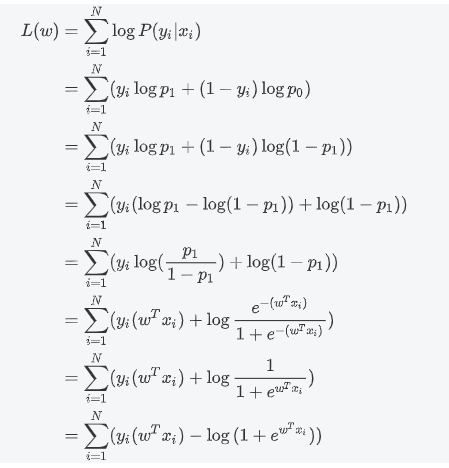
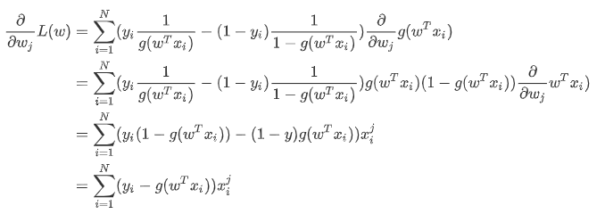

# 【关于 逻辑回归篇】 那些你不知道的事

> 作者：杨夕
> 
> NLP 百面百搭 地址：https://github.com/km1994/NLP-Interview-Notes
> 
> **[手机版NLP百面百搭](https://mp.weixin.qq.com/s?__biz=MzAxMTU5Njg4NQ==&mid=100005719&idx=3&sn=5d8e62993e5ecd4582703684c0d12e44&chksm=1bbff26d2cc87b7bf2504a8a4cafc60919d722b6e9acbcee81a626924d80f53a49301df9bd97&scene=18#wechat_redirect)**
> 
> 推荐系统 百面百搭 地址：https://github.com/km1994/RES-Interview-Notes
> 
> **[手机版推荐系统百面百搭](https://mp.weixin.qq.com/s/b_KBT6rUw09cLGRHV_EUtw)**
> 
> NLP论文学习笔记：https://github.com/km1994/nlp_paper_study
> 
> **[手机版NLP论文学习笔记](https://mp.weixin.qq.com/s?__biz=MzAxMTU5Njg4NQ==&mid=100005719&idx=1&sn=14d34d70a7e7cbf9700f804cca5be2d0&chksm=1bbff26d2cc87b7b9d2ed12c8d280cd737e270cd82c8850f7ca2ee44ec8883873ff5e9904e7e&scene=18#wechat_redirect)**
> 

> **关注公众号 【关于NLP那些你不知道的事】 加入 【NLP && 推荐学习群】一起学习！！！**

> 注：github 网页版 看起来不舒服，可以看 **[手机版推荐系统百面百搭](https://mp.weixin.qq.com/s/b_KBT6rUw09cLGRHV_EUtw)**

- [【关于 逻辑回归篇】 那些你不知道的事](#关于-逻辑回归篇-那些你不知道的事)
  - [一、动机篇](#一动机篇)
    - [1.1 为什么 需要 逻辑回归？](#11-为什么-需要-逻辑回归)
  - [二、逻辑回归 介绍篇](#二逻辑回归-介绍篇)
    - [2.1 逻辑回归 如何解决 上述问题？](#21-逻辑回归-如何解决-上述问题)
    - [2.2 什么是逻辑回归？](#22-什么是逻辑回归)
  - [三、逻辑回归 推导篇](#三逻辑回归-推导篇)
    - [3.1 逻辑回归 如何推导？](#31-逻辑回归-如何推导)
    - [3.2 逻辑回归 如何求解优化？](#32-逻辑回归-如何求解优化)
  - [四、逻辑回归 推荐流程篇](#四逻辑回归-推荐流程篇)
    - [4.1 逻辑回归 推荐流程？](#41-逻辑回归-推荐流程)
  - [五、逻辑回归 优缺点篇](#五逻辑回归-优缺点篇)
    - [5.1 逻辑回归 有哪些优点？](#51-逻辑回归-有哪些优点)
    - [5.2 逻辑回归 有哪些缺点？](#52-逻辑回归-有哪些缺点)
  - [参考](#参考)

## 一、动机篇

### 1.1 为什么 需要 逻辑回归？

- 协同过滤：仅利用用户与商品的相互行为信息进行推荐
- 协同过滤 和 矩阵分解：利用 用户与商品的“相似度”进行推荐

## 二、逻辑回归 介绍篇

### 2.1 逻辑回归 如何解决 上述问题？

- 协同过滤：仅利用用户与商品的相互行为信息进行推荐
  - 解决方法：逻辑回归：能够综合利用用户、物品、上下文等多种不同的特征，生成较为“全面”的推荐结果。
- 协同过滤 和 矩阵分解：利用 用户与商品的“相似度”进行推荐
  - 逻辑回归：将推荐问题看成一个分类问题，通过预测正样本的概率对物品进行排序。

### 2.2 什么是逻辑回归？

LR是Logistic Regression Classifier，本质上是线性回归，特殊之处在于特征到结果的映射中加入了一层逻辑函数g(z)，即先把特征线性求和，然后使用函数g(z)作为假设函数来预测。g(z)可以将连续值映射到0 和1。逻辑回归使用的g(z)函数是sigmoid函数。因此逻辑回归=线性回归 + sigmoid。

逻辑回归的表达式为

图像

## 三、逻辑回归 推导篇

### 3.1 逻辑回归 如何推导？

假设数据集为

$$
Data: {\{(x_i, y_i)\}}^{N}_{i=1} \\
x_i\in \mathbb{R}^p,y_i\in\{0,1\}
$$

sigmoid函数为

$$
sigmoid:\sigma(z)=\frac{1}{1+e^{-z}}
$$

在线性回归中有

$$
y=w^Tx+b
$$

为了方便，我们将其中的权值向量$w$和输入向量$x$进行扩充，即$w=(w_1,w_2,...,w_n,b)$；$x=(x_1,x_2,...,x_n,1)$，则式(3)可以改写为$y=w^Tx$

线性回归是将向量$x$映射为具体的数值$y$（连续），而逻辑回归是用来解决分类问题（通常为二分类问题），希望得到$0$或$1$的概率（区间$[0,1]$），即通过某种方式将数值$y$映射到区间$[0,1]$范围内。逻辑回归采用sigmoid函数来完成这样的映射，从而建立$y$与$x$之间的概率判别模型

$$
P(Y|X)
$$

有

$$
p_1=P(y=1|x)=\frac{1}{1+e^{-(w^Tx)}}
$$

$$
p_0=P(y=0|x)=1-P(y=1|x)=\frac{e^{-(w^Tx)}}{1+e^{-(w^Tx)}}
$$

得到

$$
P(Y|X)=p_1^Yp_0^{1-Y},Y\in\{0,1\}
$$

对应的似然函数为

$$
\prod_{i=1}^NP(y_i|x_i)
$$

取对数，得到对数似然函数

对$L(w)$求极大值（即极大似然估计），即可得到$w$的估计值
$$
\hat w=\mathop{\arg\max}_{w}L(w)
$$

这样，问题就变成了以对数似然函数为目标的最优化问题，可采用梯度下降法或拟牛顿法。

### 3.2 逻辑回归 如何求解优化？

令

此时，

因为这里是求最大值，采用梯度上升法：

## 四、逻辑回归 推荐流程篇

### 4.1 逻辑回归 推荐流程？

1. 数值型特征向量：将用户年龄、性别、物品属性、物品描述、当前时间、当前地点等特征转换成数值型特征向量。
2. 确定逻辑回归模型的优化目标：（以优化“点击率”为例），利用已有样本数据对逻辑回归模型进行训练，确定逻辑回归模型的内部参数。
3. 点击概率预测：在模型服务阶段，将特征向量输入逻辑回归模型，经过逻辑回归模型的推断，得到用户“点击”（这里用点击作为推荐系统正反馈行为的例子）物品的概率。
4. 排序：利用“点击”概率对所有候选物品进行排序，得到推荐列表。 

## 五、逻辑回归 优缺点篇

### 5.1 逻辑回归 有哪些优点？

1. 数字含义上的支撑 
2. 可解释性强 
3. 工程化的需要 : 其易于并行化、模型简单、训练开销小等特点

### 5.2 逻辑回归 有哪些缺点？

1. 表达能力不强， 无法进行特征交叉， 特征筛选等一系列“高级“操作（这些工作都得人工来干， 这样就需要一定的经验， 否则会走一些弯路）， 因此可能造成信息的损失
2. 准确率并不是很高。因为这毕竟是一个线性模型加了个sigmoid， 形式非常的简单(非常类似线性模型)，很难去拟合数据的真实分布
3. 处理非线性数据较麻烦。逻辑回归在不引入其他方法的情况下，只能处理线性可分的数据， 如果想处理非线性， 首先对连续特征的处理需要先进行离散化（离散化的目的是为了引入非线性），如上文所说，人工分桶的方式会引入多种问题。
4. LR 需要进行人工特征组合，这就需要开发者有非常丰富的领域经验，才能不走弯路。这样的模型迁移起来比较困难，换一个领域又需要重新进行大量的特征工程。

## 参考

- [深度学习与推荐系统 王喆](https://item.jd.com/12630209.html)